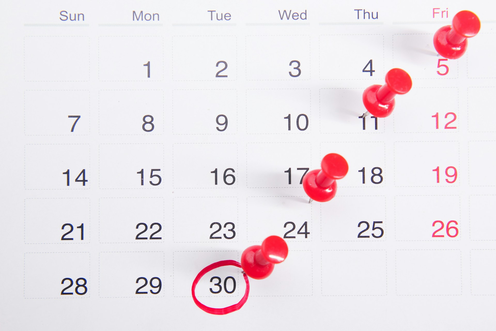

Last May, I found myself in charge of something I'd never done before: creating the entire programme for a developer conference.
[SoJava 2025](https://www.sogeti.nl/events/sojava-conferentie-2025/) was my first shot at conference organizing. The event was set for May 15th at the Forum in Groningen, and while I was part of the broader organizing committee, I had one clear responsibility: build a programme that Java developers would actually want to attend.

No pressure, right?

I knew the basics. Java developers are particular about their content. They want practical insights, real-world examples, and speakers who know what they're talking about. But knowing what makes a good talk and actually putting together a full afternoon's worth of them? That's different.

What followed were months of reaching out to speakers, juggling schedules, second-guessing topic choices, and hoping I was building something worthwhile. Some things went better than expected. Others didn't go as planned at all.
Here's what I learned along the way.

## Lesson 1: Start way earlier than you think
I thought four months would be plenty of time to find speakers. I was wrong.

My plan seemed solid. As a former Java developer and current architect who speaks at conferences, I had a good network of potential speakers. I figured I could tap into those connections and fill the programme without much trouble.

But reality hit fast. Some speakers were already booked for other conferences. Others liked the idea but couldn't commit because four months wasn't enough time for them to develop a solid talk from scratch.

 They need time to come up with a compelling topic, research it properly, build their presentation, and practice it until it flows naturally. The speakers who care about delivering quality content - the ones you actually want - need more runway than I gave them.

The speakers who did commit were absolute legends. Every single one delivered impressive presentations that really connected with the audience. But I had to work much harder than necessary to get there.

If I had started two months earlier, I would have had first pick of available speakers before other conferences locked them in. I also would have given potential speakers enough breathing room to develop something they were genuinely excited about, rather than feeling rushed.

Next time, I'm starting the speaker outreach process at least six months in advance. Maybe longer.

* Photo by <a href="https://unsplash.com/@towfiqu999999?utm_content=creditCopyText&utm_medium=referral&utm_source=unsplash">Towfiqu barbhuiya</a> on <a href="https://unsplash.com/photos/a-calendar-with-red-push-buttons-pinned-to-it-bwOAixLG0uc?utm_content=creditCopyText&utm_medium=referral&utm_source=unsplash">Unsplash</a> *
      

## Lesson 2: Plan your conference structure first
This year, everything fell into place. But I'll be honest - that was mostly luck.

I didn't start with a clear outline of how the day should flow. Instead, I just started booking speakers and hoped it would work out. Somehow, it did. We ended up with a structure that actually made sense:

- Opening keynote (fun, not necessarily Java-related)
- Three rounds of breakout sessions (two talks running parallel each round)
- Closing keynote (Java-related and entertaining)
- Drinks and bitterballen

 The opening keynote got people energized without diving straight into technical details. The breakout sessions gave attendees choices and kept the energy up. And the closing keynote sent everyone off on a high note before the networking started.

But I got lucky. What if I had ended up with six highly technical talks and no lighter content? Or three similar talks all scheduled back-to-back? The day could have been a slog.

Next time, I'm creating the conference outline first. I'll decide on the rhythm and types of sessions before I start reaching out to speakers. That way, I can be more intentional about what I'm looking for instead of just hoping the pieces fit together.

## Lesson 3: Don't do all the outreach yourself
Since this was the first time SoJava was open to all developers, we didn't have an established reputation. Speakers didn't know about us yet, so I had to actively reach out to everyone.

That meant I was doing all the work. Researching potential speakers, crafting personalized emails, following up, managing responses. It was time-consuming and limited me to only the people I already knew or could find through my network.

The approach worked, but it wasn't efficient. And I probably missed out on great speakers I simply didn't think of or couldn't find.

Next time, I'll still do active outreach - that personal touch matters, especially for a newer conference. But I'll also open a Call for Papers. That way, speakers can come to me with ideas I hadn't considered. 

A CFP also takes some pressure off me to think of everything. Instead of trying to imagine every possible topic that would interest Java developers, I can let the community show me what they're excited about.

It's about balance. Direct outreach for the speakers you really want, plus a CFP to discover the ones you didn't know you wanted.

## Ready for Round Two

There were probably dozens of smaller lessons along the way - little things about logistics, communication, and the thousand tiny decisions that go into putting together a conference. But these three were the real nuggets of wisdom that will stick with me.

Start earlier than you think you need to. Plan your conference structure before you start booking speakers. And don't try to do all the outreach yourself.

I'm already looking forward to SoJava 2026. It'll be back in May or June of next year, and this time I'll be ready with everything I learned from round one.

Keep an eye out for our announcements. Maybe I'll see you in Groningen.